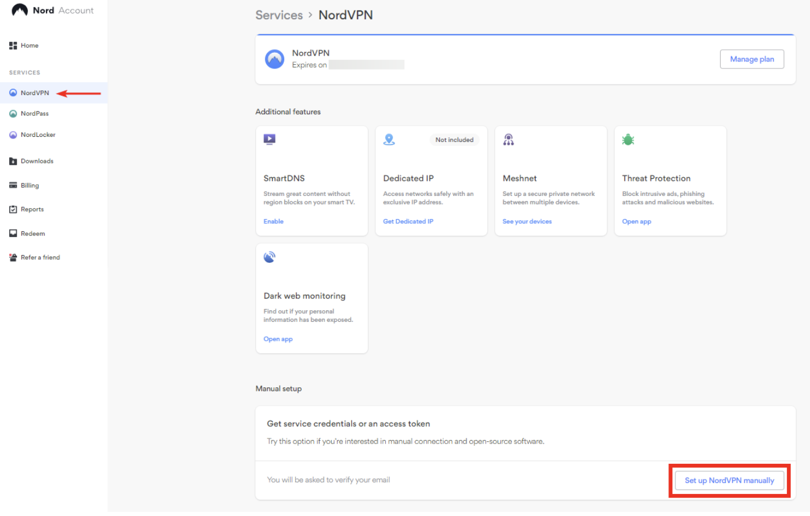
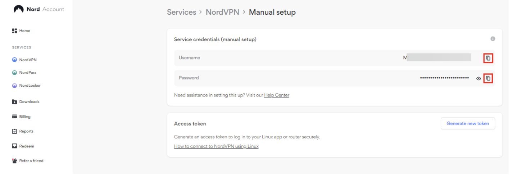

# Auto Connect NordVPN via OpenVPN

A python script that automatically connects to a random nordVPN server with the openVPN CLI. 
Set up the project and then to run, clone the repo and then execute ```python3 main.pu```

This script extends from the bash script by Mattia Tezzele that finds the closes nordVPN server: https://github.com/mrzool/nordvpn-server-find.git

## Set up
### Dependencies

This script depends on the openvpn cli tool to run. The bash script for finding servers depends on jq and requires bash4 to run.
```text
sudo apt install openvpn
sudo apt install jq
sudo apt install bash4
```

### Setting Configuration Parameters
To set config paramaters for the script, in the root directory of the repository, create a file titled ```server_target.cfg``` with the following contents:
```text
[CONFIG]
country='' # two character country code
protocol='' # udp or tcp
nord_user='' # nord manual username string
nord_pass='' # nord manual password string
```
Replace the string values with your desired parameters in the config.

### Acquiring nordVPN manual credentials
Visit the nord account dashboard: https://my.nordaccount.com/dashboard/nordvpn/

Scroll down and select: Set Up NordVPN manually


Copy your credentials



## Additional notes
The original intent for this repo was to be deployed to linux server such as ubuntu and debian servers. 
This script would then be run at specified time intervals using cron to constantly change the ip/location of the server.