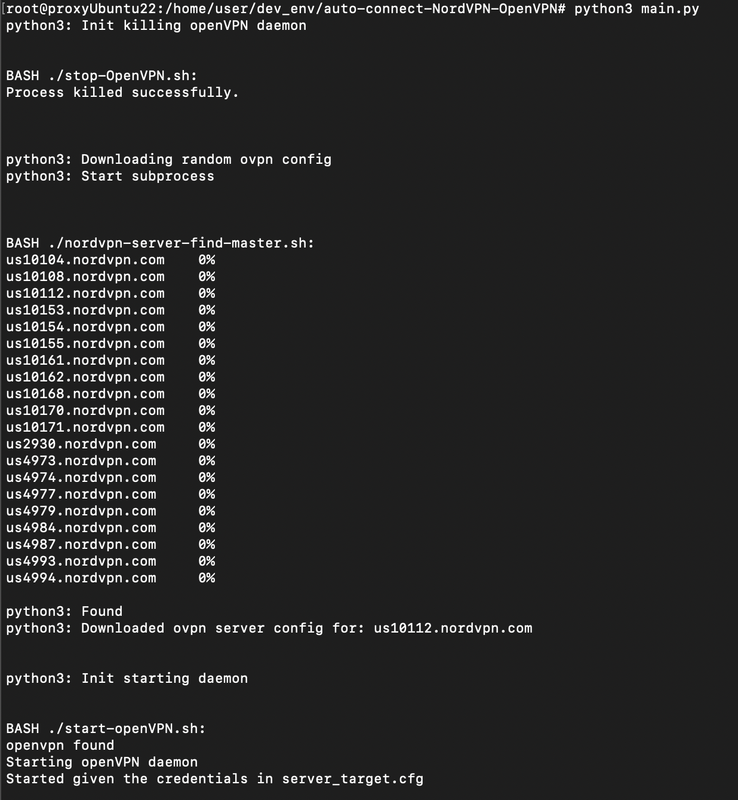
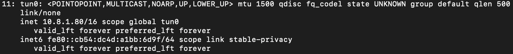

# Auto Connect NordVPN via OpenVPN

A python script that automatically connects to a random nordVPN server using the openVPN tunnel daemon. 
Simply clone the repo, set up your configurations and then execute with privileged access ```python3 main.py``` 

This script extends from the bash script by Mattia Tezzele that finds the closes nordVPN server: https://github.com/mrzool/nordvpn-server-find.git

## Set up
### Dependencies

This python script depends on the openvpn daemon tool to run. The bash script for finding servers depends on jq and requires bash4 to run.
```text
sudo apt install openvpn
sudo apt install jq
sudo apt install bash4
```

### Setting Configuration Parameters
To set config paramaters for the script, in the root directory of the repository, create the config file titled ```server_target.cfg``` 
```commandline
touch server_target.cfg
```

Add the following contents to the file:
```text
[CONFIG]
country='{two character country code}'
protocol='{udp or tcp}'
nord_user='{nord manual username string}'
nord_pass='{nord manual password string}'
```
Replace the string values with your desired parameters in the config.


### Acquiring nordVPN manual credentials
Visit the nord account dashboard: https://my.nordaccount.com/dashboard/nordvpn/

Scroll down and select: Set Up NordVPN manually


Copy your credentials


## Additional notes
The original intent for this repo was to be deployed to linux servers such as ubuntu and debian servers. 
This script would then be run at specified time intervals using cron to constantly change the ip/location of the server.

### Example

Here is how the script should look when ran:


Verify that your vpn connection has been established with ```ipconfig``` or ```ip address```.
There should be a new tunnel called ```tun0``` with a new ipv4 address.


You can also check if the openvpn process is running by using: ```ps ax``` 

### Running as a Systemd Service
Please have a look at the readme file in ```systemd-service-files/```