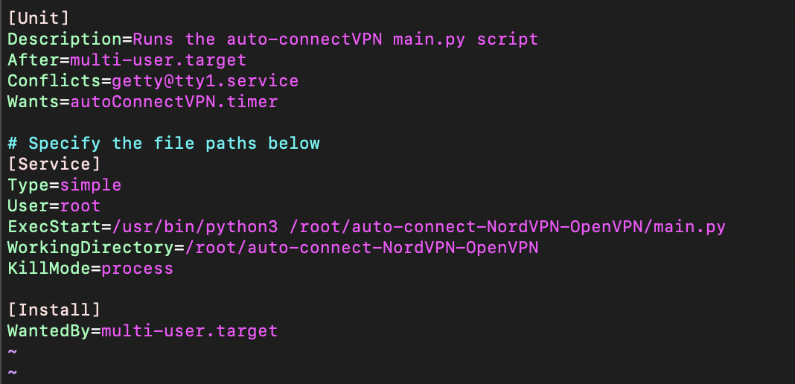

## Setting Systemd Timers
To schedule the script to run repeatedly in the background, you can set it up as a systemd service with a timer.
This directory provides the files you need to get started with creating a service for the script.

### Set Up
For good measure, it's a good idea to make a backup of these files:
```commandline
cp autoConnectVPN.service autoConnectVPN.service.bk
cp autoConnectVPN.timer autoConnectVPN.timer.bk
```

Then move the files to where the systemd config is. Typically systemd configs are located at ```/etc/systemd/system```
```commandline
mv autoConnectVPN.service /etc/systemd/system
mv autoConnectVPN.timer /etc/systemd/system
```

Modify the autoConnectVPN.service using a text editor and add the required file paths specified in the file.

Here is an example of how the service file should look: 



To start the service copy the following:
```commandline
systemctl start autoConnectVPN.service
```

To monitor the outputs from the script running from a service, type:
```commandline
journalctl -S today -f -u autoConnectVPN.service
```
or you can manually navigate the system log
```
journalctl
```

If you wish to change the frequency of executions for the service, modify the OnCalendar parameter in the timer unit file.
Further reading: https://opensource.com/article/20/7/systemd-timers